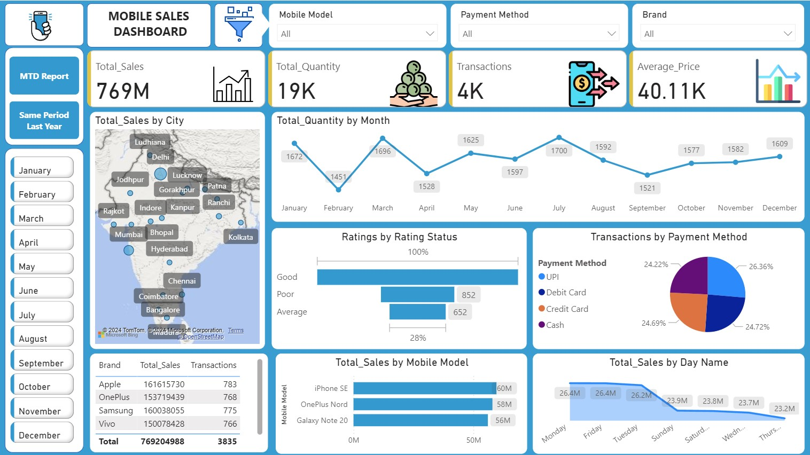

# motorola_sales_dashboard
Power BI Mobile Sales Dashboard created while learning from Satish Dhawale’s 30 Day Power BI Course on YouTube. This project analyzes Motorola mobile phone sales across India using interactive visuals, KPIs, and filters to track sales trends, transactions, quantity sold, and payment methods.
# 📊 Power BI Mobile Sales Dashboard

## 📌 Project Overview

This project is an interactive **Power BI dashboard** created while learning Power BI through **Satish Dhawale’s 30 Day Power BI Course on YouTube**.
The dashboard analyzes **Motorola mobile phone sales across different cities in India**, helping visualize sales performance, customer behavior, and transaction trends.

The goal of this project was to practice **data visualization, dashboard design, and business intelligence concepts** using Power BI.

---

## 📁 Dataset

The dataset contains mobile sales transaction data across India.

**Key fields include:**

* Transaction ID
* Date
* City
* Brand
* Mobile Model
* Units Sold
* Price
* Payment Method
* Customer Ratings

Dataset Source: Practice dataset used during the Power BI learning course.

---

## 📊 Dashboard Features

### Key Performance Indicators (KPIs)

* **Total Sales**
* **Total Quantity Sold**
* **Total Transactions**
* **Average Price**

### Interactive Filters

* Mobile Model
* Payment Method
* Date (Year, Quarter, Month, Day)
* Month Selection

### Visualizations

* 📈 Sales Trend Analysis (Monthly / Daily)
* 🗺 City-wise Sales Map
* 📊 Sales by Mobile Model
* 📊 Sales by Brand
* 🧾 Transactions by Payment Method
* ⭐ Customer Rating Analysis
* 📅 Same Period Last Year Sales Comparison
* 📊 Sales by Day of Week

---

## 📷 Dashboard Preview

### Main Dashboard

### MTD Report

### Same Period Last Year Report

---

## 🛠 Tools & Technologies Used

* **Power BI**
* **Microsoft Excel**
* **DAX (Data Analysis Expressions)**
* **Data Visualization Techniques**

---

## 📈 Key Learnings

Through this project I learned:

* Importing and transforming data in **Power BI**
* Creating **interactive dashboards**
* Using **DAX measures for calculations**
* Designing **professional dashboard layouts**
* Implementing **filters and slicers**
* Performing **sales trend analysis**

---

## 🚀 How to Use

1. Download the `.pbix` file from this repository.
2. Open it using **Microsoft Power BI Desktop**.
3. Explore the interactive dashboard using filters and slicers.

---

## 🎓 Learning Source

This project was created as part of learning Power BI from:

**Satish Dhawale – 30 Day Power BI Course (YouTube)**

---

## 📬 Contact

If you have any suggestions or feedback, feel free to connect.

**Author:** md shakeb ahmad
**GitHub:** https://github.com/shakebahmad02-dot
